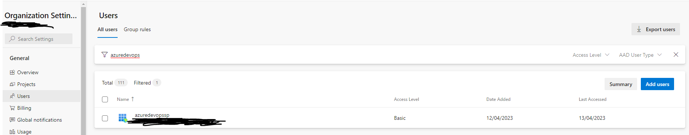
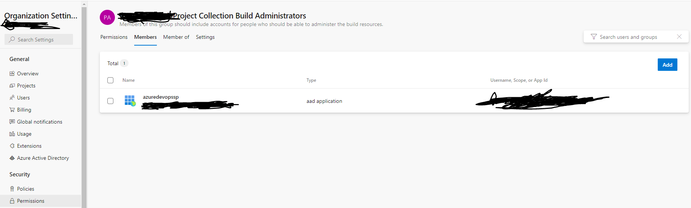

# Using a ServicePrincipal to connect Pipeline Agents

Microsoft released new possibilities to connect to Azure DevOps via ServicePrincipals from Azure in March 2023. This is an alternative connection method to the well known PATs. Those where designed to give personal access to Azure DevOps, but where often used by "ServiceAccounts" to accomplish this.

[Microsofts Blog](https://devblogs.microsoft.com/devops/introducing-service-principal-and-managed-identity-support-on-azure-devops/)

# Create the ServicePrincipal

We are using Terraform to create a serviceprincipal an alternative could be the [Az Cli Docu](https://learn.microsoft.com/en-us/cli/azure/create-an-azure-service-principal-azure-cli).

```bash
az ad sp create-for-rbac --name demoSp
```

You need the following information about your ServicePrincipal:

- ClientId / appId
- ClientSecret / password
- TenantId / tenant

# Add ServicePrincipal to Azure DevOps and configure grants

After creating the ServicePrincipal you have to login to azure devops and give it the correct grants.

- Add it as a "Basic" User with no access to your organisation.
  
- Add it to the Permission [Organisation]\Project Collection Build Administrators
  
- Add a new AgentPool "on-prem"
- Add the permission "Administratrion" to [Organisation]\Project Collection Build Administrators

# Get a token via .net

The initial code was posted in the [Microsoft Docs](https://learn.microsoft.com/en-us/azure/devops/integrate/get-started/authentication/service-principal-managed-identity?view=azure-devops#use-the-azure-ad-token-to-authenticate-to-azure-devops-resources) and on [Github](https://github.com/microsoft/azure-devops-auth-samples/tree/master/ServicePrincipalsSamples/ClientLibsNET/0-SimpleConsoleApp-AppRegistration)

You only need the generated token from the ClientSecretCredential. Which is generated in this code

```csharp
var credentials = new ClientSecretCredential(azureDevOpsOptions.TenantId, azureDevOpsOptions.ClientId, azureDevOpsOptions.ClientSecret);
var accessToken = await credentials.GetTokenAsync(new Azure.Core.TokenRequestContext(new[] { azureDevOpsAppScope }));
Console.WriteLine(accessToken.Token);
```

# Use the token to register an agent

You should store this token in a secret store and refresh it often. In the Video from the Microsoft docs they said the token is only vailid for 1 hour!.

When you register your self hosted agent you can now simply use your generated token instead of the PAT to connect to azure devops.

Examples for self hosted agents can be found [here for Docker](https://learn.microsoft.com/en-us/azure/devops/pipelines/agents/docker?view=azure-devops) or [here for Windows](https://learn.microsoft.com/en-us/azure/devops/pipelines/agents/v2-windows?view=azure-devops)

We've choosen the docker one.
